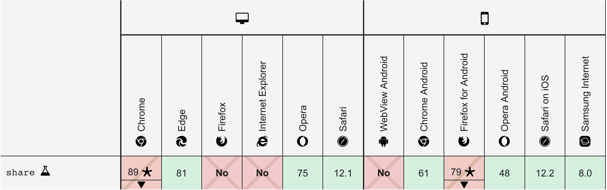

# PWA sharing

Pwa allows you to share text, link, or document from a webpage on a mobile phone.

## How is it working (link and text)?

```js 
navigator.share()
```

This function is the only thing needed for sharing.
It is a promise which success if the user shared, and, throws an error if the user aborts the sharing.

example:
```js
navigator.share({
  title: 'the title for this shaeing', // I can't yet figure out where can we see it in the sharing process
  text: 'the text you want to share',
  url: 'https://www.superherocheesecake.com/'
})
  .then(() => {/*the user well shared*/})
  .catch(() => {/*the user abort the sharing*/})

```

## How is it working (Files)?(
The sharing function is the same, but to check if it's available ([check browser compatibility](#browsercomp))
there is a new method ```navigator.canShare()```

example of usage:

```js
if (navigator.canShare && navigator.canShare({ files: filesArray })) {
  navigator.share()// share here
}
```

Then replace `url` by `files` in ```navigator.share``` function which is waiting for an Array of file

complete example:

```js
const handleClickShareButon = async () => {
  const result = await fetch('path/to/the/file')
  const blob = await result.blob()
  const file = new File([blob], "file_name.png", {type: "image/png"})
  const filesArray = [file]

  if (navigator.canShare && navigator.canShare({ files: filesArray })) {
    navigator.share({
      title: 'the title',
      text: 'hi check out that document',
      files: filesArray
    })// share here
  }
}
```

This isn't working on firefox mobile


## Some constraints:

### HTTPS
For some security reasons, browsers do not allow this function if the website isn't secured by SSL (HTTPS)


### <a name="browsercomp">browser compatibility</a>
There is the browser compatibility from MDN documentation:



It doesn't work for chrome on MAC

firefox mobile can't share file or text

When sharing isn't possible on the browser, the method ```navigator.share()``` do not exist.
So, for testing if sharing is possible, the easiest method is the following:
```js
if(navigator.share) {
  // sharing is possible here
} else {
  // sharing is  ot possible
}
```


## Let's try

you can try [here](https://bolex222.github.io/testPwaSharing/)


